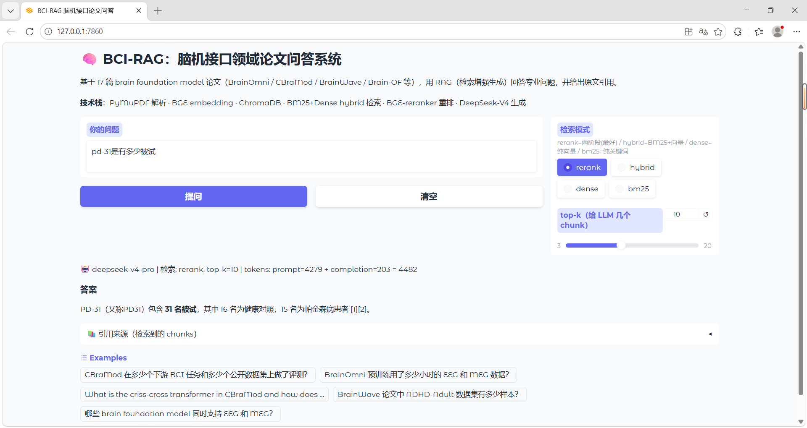

# BCI-Paper-Assistant · 脑机接口论文知识问答系统

> 一个基于 RAG（检索增强生成）的领域问答系统：把 17 篇脑信号基础模型（brain foundation model）论文变成一个可以用自然语言提问、并给出**原文引用**的知识库。问"CBraMod 在 BCIC2020-3 上的 Balanced Accuracy 是多少"，它会从论文里检索证据并回答 `0.5373 ± 0.0108`，附上出处。


<!-- TODO: 把界面截图放到 images/demo.png -->

---

## ✨ 项目动机

脑信号基础模型（brain foundation model）是近年快速发展的方向，相关论文里散落着大量具体信息——每个模型在哪些数据集上评测、benchmark 分数多少、用了什么架构、和谁做对比。这些信息查阅频繁却分散：手动翻 PDF 效率低；而直接问通用大模型有两个硬伤——**会产生幻觉**（编造不存在的数字），且**无法给出可验证的出处**。

本项目想回答一个问题：

> **在一个边界明确、专业性强的文献集合上，RAG 能否做到比"直接把文档全文丢给大模型"更可靠、且每个回答都能溯源到原文？**

为此，我选取该领域 17 篇代表性论文作为知识库，构建了一个支持自然语言提问、答案带原文引用、并且会明确拒答资料外问题的领域问答系统。这 17 篇论文我都通读过且掌握其中事实的标准答案，因而能够客观判断系统回答的对错——这是项目能持续迭代调优的前提。


---

## 🎯 它能做什么

- **专业事实问答**：数据集被试数、采样率、通道数、benchmark 分数、SOTA 对比、模型架构差异……
- **原文溯源**：每个回答都标注 `[1][2]` 引用，并可展开看检索到的原文片段，杜绝"无法验证的回答"
- **抗幻觉**：资料里没有的内容会明确回答"提供的资料中没有足够信息"，而不是编造
- **多种检索模式可切换**：`rerank`（两阶段，最准）/ `hybrid` / `dense` / `bm25`，可直观对比不同策略效果

---

## 🏗️ 技术架构

```
PDF ──parse──> 纯文本 ──chunk──> 文本块 ┐
                                      ├─> BGE 向量 ──> ChromaDB ┐
                         表格抽取 ─────┘                        │
                                       └─> BM25 索引 ───────────┤
                                                                │
用户问题 ──> [阶段1 召回: BM25 + 向量 via RRF] ──> top-60 候选 ──┘
                                                       │
            [阶段2 重排: BGE-reranker cross-encoder] ──> top-10
                                                       │
            [拼 prompt + 引用编号] ──> DeepSeek-V4 ──> 答案 + 引用
```

| 环节 | 选型 | 说明 |
|---|---|---|
| PDF 解析 | PyMuPDF (fitz) | 默认 `get_text()` 正确处理双栏阅读顺序，比 PyPDF2 干净 |
| 切分 | RecursiveCharacterTextSplitter | chunk_size=1200, overlap=200 |
| 表格 | PyMuPDF `find_tables()` | 额外把表格抽成结构化 chunk |
| Embedding | `BAAI/bge-base-en-v1.5` (768维) | BAAI 自家检索模型，MTEB 表现强 |
| 向量库 | ChromaDB | 本地持久化，cosine |
| 关键词检索 | BM25Okapi | 保留连字符 token（`BCIC2020-3` 不被切散）|
| 混合检索 | Reciprocal Rank Fusion | 融合 BM25 + dense，无需手调权重 |
| 重排 | `BAAI/bge-reranker-base` | cross-encoder，把含答案的 chunk 顶回 top-k |
| 生成 | DeepSeek-V4 | OpenAI 兼容；严格抗幻觉 prompt |
| 界面 | Gradio | 一键 `share=True` 公网访问 |

---

## 🔬 工程过程中的关键问题与解法

> 这部分是项目的核心 —— RAG 不是"接起来就能用"，难点在于把检索质量调到可靠。

1. **PDF 解析翻车 → 换库**：先用 PyPDF2/pdfplumber，双栏论文出现"左右栏交错""单词粘连"。换 PyMuPDF 后阅读顺序正确，速度快 10 倍。
2. **References 截断切掉了 70% 内容（严重 bug）**：早期为去噪按"References"标题截断正文，结果把论文 appendix 里的**实际结果表**也切了——17 篇平均只保留了 44%，CBraMod 只剩 30%，导致"CBraMod 在 BCIC2020-3 的分数"这类问题完全答不出。移除截断后，关键词覆盖率（如 `BCIC2020-3`）从 1 个 chunk 涨到 17 个。
3. **纯向量检索对"精确编号"召回差**：`BCIC2020-3`、`PD-31`、`ADHD-200` 这类数据集编号，dense embedding 当成普通数字串，召回不到。加 **BM25 + 向量的 hybrid 检索**解决。
4. **含答案的 chunk 被挤出 top-k**：宽泛但相关的 chunk 把含具体数字的 chunk 挤到 rank 20+。加 **cross-encoder 重排**把它顶回来。
5. **表格被线性化**："方法 × 数据集"的表格被解析成竖排列表，行列对应丢失。通过①更大的 chunk_size 让整表进一个 chunk ②prompt 里加"竖排表格按列对齐"的指引，让模型能从中抽出指定单元格。

**效果**：一组专业 factoid 测试问题，从最初的 **0/5** 提升到 **4~5/5**；更大的人工测试约 **8/10** 达到或超出预期。

---

## ⚠️ 已知局限

- **多跳问题**：答案分散在多个不相邻 chunk 且彼此不互相提及时（如"ADHD-200 用什么脑图谱"——ROI 数和 atlas 名在不同段落），仍可能答不全。
- **语料边界**：若某事实只存在于被引用的外部文献、而本文未复述，则无法回答（这是 RAG 的固有边界，也正是它"不幻觉"的体现）。
- **无线框表格**：纯空白对齐的表格 `find_tables()` 检测不到，依赖正文 chunk 兜底。
- **延迟**：reranker 在 CPU 上每问约 20 秒（GPU 可大幅加速）。

---

## 📚 知识库论文（17 篇）

BrainOmni · CBraMod · BrainWave · Brain-OF · LaBraM (Jiang 2024) · CSBrain · BrainBERT · Brain Treebank · MindEye2 · SleepLM · BrainFLORA · TRIBE v2 · Omni-iEEG · NeuroSTORM (Wang fMRI) · Tang Omni Modalities · Thapa Sleep FM · Seeing Beyond the Brain

> 原始 PDF 因版权未上传，请自行从 arXiv / 各会议获取后放入 `Article/`。

---

## 🚀 安装与运行

```bash
# 1. 建虚拟环境（Python 3.10）
py -3.10 -m venv .venv
.\.venv\Scripts\activate          # Windows
pip install -r requirements.txt

# 2. 配置 API key
copy .env.example .env            # 然后编辑 .env 填入 DeepSeek API key

# 3. 构建索引（需先把 PDF 放进 Article/）
python src/parse_pdf.py           # PDF → 文本
python src/chunker.py             # 切分
python src/extract_tables.py      # 抽表格
python src/build_bm25.py          # BM25 索引
python src/build_index.py         # 向量索引（首次会下载 BGE 模型）

# 4. 启动
python app.py                     # 浏览器打开 http://127.0.0.1:7860
```

> 命令行交互：`python src/chat.py`

---

## 🧠 我的思考与改进方向

<!-- TODO: 这部分用你自己的话写，是面试加分项。可以聊： -->
<!-- - 做完这个项目你对 RAG 的理解（chunk size 权衡、检索 vs 生成的边界、抗幻觉的代价）-->
<!-- - 如果继续做会怎么改进（reranker 上 GPU、做系统化评测、query 改写处理多跳、加 query 缓存）-->
<!-- - 这个项目和"直接把 PDF 丢给大模型"相比的价值在哪 -->

---

## 📁 项目结构

```
bci-paper-assistant/
├── Article/                # 原始 PDF（不入库，需自备）
├── data/chunks/chunks.jsonl  # 切分好的 chunk（含表格）
├── src/
│   ├── parse_pdf.py        # PDF 解析（PyMuPDF）
│   ├── chunker.py          # 文本切分
│   ├── extract_tables.py   # 表格抽取
│   ├── build_bm25.py       # BM25 索引
│   ├── build_index.py      # 向量索引
│   ├── retrieve.py         # 两阶段检索（hybrid + rerank）
│   ├── qa.py               # RAG pipeline + prompt
│   └── chat.py             # 命令行交互
├── app.py                  # Gradio 网页界面
├── requirements.txt
└── .env.example
```
